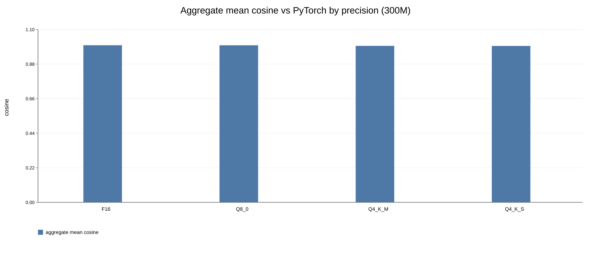
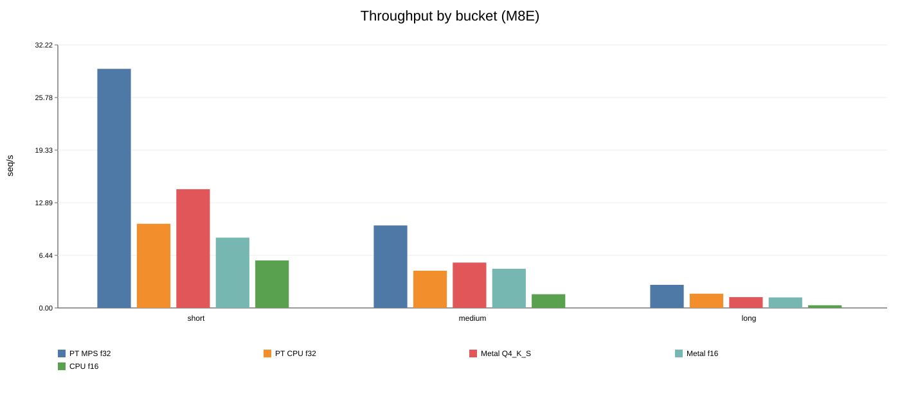
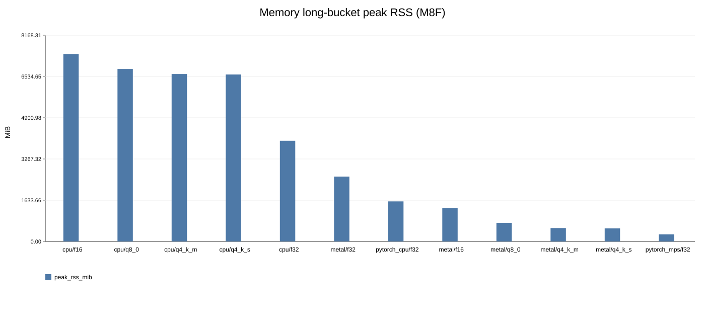
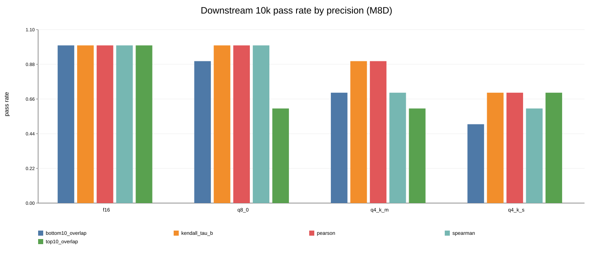

# esmc.cpp

Metal-accelerated C/C++ inference for [ESM Cambrian](https://www.evolutionaryscale.ai/blog/esm-cambrian) (ESM-C), built on [llama.cpp](https://github.com/ggml-org/llama.cpp) / ggml.

- **Source:** [github.com/AnanyaP-WDW/esmc.cpp](https://github.com/AnanyaP-WDW/esmc.cpp)
- **Pre-converted GGUF models:** [AnanyaPathak/esmc-300m-gguf](https://huggingface.co/AnanyaPathak/esmc-300m-gguf) on Hugging Face (model card with benchmarks, quick start, and usage)

## Build (milestone 0)

```bash
git submodule update --init --recursive
cmake -B build -DCMAKE_BUILD_TYPE=Release
cmake --build build -j8
./build/esmc-embed --help
```

Or: `make -C build esmc-embed`

## Weight inspection (milestone 1)

```bash
python3 -m venv .venv && .venv/bin/pip install -r tools/requirements.txt
hf download biohub/ESMC-300M --local-dir ./esmc-300m
.venv/bin/python tools/inspect_esmc_weights.py ./esmc-300m
```

The biohub checkpoint uses the native `esmc.*` layout (fused QKV, fused SwiGLU `fc1_weight`).
The HuggingFace `model.layers.*` layout in plan §2.1 is also supported when present.

## Convert to GGUF (milestone 2)

```bash
.venv/bin/pip install -e ./ggml/gguf-py -r tools/requirements.txt
.venv/bin/python tools/convert_esmc_to_gguf.py ./esmc-300m ./models/esmc-300m-f16.gguf

# Verify metadata + tensors
.venv/bin/python tools/verify_gguf.py ./models/esmc-300m-f16.gguf
.venv/bin/python ./ggml/gguf-py/gguf/scripts/gguf_dump.py ./models/esmc-300m-f16.gguf --no-tensors
```

## Tokenizer test (milestone 4)

```bash
.venv/bin/python tests/test_tokenizer.py
# ACDEF -> [0, 5, 23, 13, 9, 18, 2]  (matches HF tokenizer.json)
```

## Layer-0 Q/K check (milestone 5)

```bash
.venv/bin/python tests/check_layer0_qk.py
./build/esmc-embed -m ./models/esmc-300m-f16.gguf -s ACDEF --layers 8 --no-metal
```

## Load GGUF in C++ (milestone 3)

```bash
cmake --build build -j8
./build/esmc-embed -m ./models/esmc-300m-f16.gguf --verify-load --no-metal
```

## Embed sequences

```bash
# Per-residue embeddings (.npy: [n_tokens, n_embd])
./build/esmc-embed -m ./models/esmc-300m-Q4_K_M.gguf \
    -s "MKTVRQERLKSIVRILERSKEPVSGAQLAEELSVSRQVIVQDIAYLRSLGY" \
    --pool none --output embedding.npy

# Mean-pooled sequence embedding (strips CLS/EOS)
./build/esmc-embed -m ./models/esmc-300m-Q4_K_M.gguf \
    -s "MKTVRQ..." --pool mean --output embedding.npy
```

## Reproduce the paper results (300M, end-to-end)

The commands below reproduce every number in the paper, in order, from a clean
clone. Run them on an Apple Silicon Mac (36 GB recommended) for the full
CPU + Metal matrix; non-Apple/CPU-only hosts can run everything except the Metal
rows. Budget ~3 GB of downloads (checkpoint + ProteinGym archive) and a few hours
for the complete benchmark matrix.

**Prerequisites:** macOS with the Xcode command-line tools, CMake ≥ 3.14,
Python ≥ 3.10, and a HuggingFace account/token for the checkpoint download. The
PyTorch reference and the PyTorch baselines require `torch`; the Metal backend
requires an Apple GPU.

### 1. Clone and build

```bash
git clone --recursive https://github.com/AnanyaP-WDW/esmc.cpp.git
cd esmc.cpp
git submodule update --init --recursive   # only if you cloned without --recursive

cmake -B build -DCMAKE_BUILD_TYPE=Release
cmake --build build -j8                   # builds esmc-embed, esmc-bench, esmc-quantize
```

### 2. Python environment

```bash
python3 -m venv .venv
.venv/bin/pip install -r tools/requirements.txt
.venv/bin/pip install -e ./ggml/gguf-py
.venv/bin/pip install torch               # PyTorch reference + baselines
```

### 3. Download the ESM-C 300M checkpoint

```bash
hf download EvolutionaryScale/esmc-300m-2024-12 --local-dir ./esmc-300m
```

### 4. Convert to GGUF (F16 + F32) and verify

```bash
.venv/bin/python tools/convert_esmc_to_gguf.py ./esmc-300m ./models/esmc-300m-f16.gguf --dtype f16
.venv/bin/python tools/convert_esmc_to_gguf.py ./esmc-300m ./models/esmc-300m-f32.gguf --dtype f32
.venv/bin/python tools/verify_gguf.py ./models/esmc-300m-f16.gguf
```

### 5. Quantize from the F32 GGUF

```bash
cmake --build build --target esmc-quantize
./build/esmc-quantize models/esmc-300m-f32.gguf models/esmc-300m-Q8_0.gguf   Q8_0
./build/esmc-quantize models/esmc-300m-f32.gguf models/esmc-300m-Q4_K_M.gguf Q4_K_M
./build/esmc-quantize models/esmc-300m-f32.gguf models/esmc-300m-Q4_K_S.gguf Q4_K_S
```

### 6. Staged validation (tokenizer → layer-0 Q/K → full forward)

```bash
.venv/bin/python tests/test_tokenizer.py                       # M4: token IDs
.venv/bin/python tests/check_layer0_qk.py                      # M5: layer-0 Q/K probe
.venv/bin/python tests/validate.py --no-metal                  # M6: full forward (CPU)
.venv/bin/python tests/validate.py --metal --compare-cpu-metal # CPU/Metal parity
```

### 7. Generate the 100-sequence PyTorch reference

The correctness harness compares against a PyTorch reference that is **not**
checked into git (~107 MB). Regenerate it once from the checkpoint:

```bash
.venv/bin/python tests/generate_reference.py \
    --fasta benchmarks/sequences_correctness.fasta \
    --output tests/reference_embeddings.npz
```

### 8. Run the benchmarks

```bash
# Numerical correctness (paper Table 2): all precisions vs PyTorch, 100 Swiss-Prot seqs
.venv/bin/python benchmarks/correctness.py

# Throughput (paper Table 3, Fig 1): esmc.cpp CPU/Metal + PyTorch CPU/MPS
cmake --build build --target esmc-bench
.venv/bin/python benchmarks/throughput.py --config benchmarks/config_throughput_300m.json

# Memory footprint (paper Fig 2): peak RSS across all 36 configurations
.venv/bin/python benchmarks/memory.py --config benchmarks/config_memory_300m.json

# Downstream ProteinGym variant-effect (paper Table 4, Fig 3): 10 assays x 1000 variants
.venv/bin/python benchmarks/fetch_proteingym_subset.py --download \
    --selection-mode multi-assay --max-assays 10 --max-rows 1000 --min-rows 1000 \
    --max-length 512 --output-dir benchmarks/proteingym_subset_10k \
    --manifest benchmarks/datasets/proteingym_subset_10k_manifest.json
.venv/bin/python benchmarks/downstream.py --config benchmarks/config_downstream_300m_10k.json
```

### 9. Figures and reproduction bundle

```bash
.venv/bin/python benchmarks/paper_artifacts.py          # figure SVGs + summary CSVs
.venv/bin/python benchmarks/make_reproduction_bundle.py # self-contained results bundle
```

## Benchmark results (300M)

**Host:** Apple M4 Max (arm64), 36 GB unified memory, macOS 26.5.  
**Reference:** official PyTorch ESM-C 300M (`tests/ref_forward.py` on native safetensors).  
**Datasets:** 100 reviewed human [UniProt](https://www.uniprot.org/) sequences (correctness); length-bucketed FASTA (throughput/memory); [ProteinGym](https://www.proteingym.org/) 10-assay × 1000-variant subset (downstream).

Raw CSV/JSON artifacts live under `results/`; paper-ready Markdown/LaTeX tables are regenerated by `benchmarks/make_reproduction_bundle.py` → `results/reproduction_bundle/tables/`. Full experiment log: [lab_manual.md](lab_manual.md).

### Plots

Regenerate with `benchmarks/paper_artifacts.py` (writes SVG; PNG if matplotlib is installed).

#### Numerical correctness (aggregate mean cosine vs PyTorch)



[SVG](figures/correctness_mean_cosine.svg)

#### Throughput (seq/s by length bucket)



[PDF](figures/throughput_seqps.pdf) · [SVG](figures/throughput_seqps.svg)

#### Peak memory (long bucket, 36 GB M4 Max)



[PDF](figures/memory_long_rss.pdf) · [SVG](figures/memory_long_rss.svg)

#### Downstream preservation (ProteinGym 10-assay pass rates)



[PDF](figures/downstream_10k_pass_rate.pdf) · [SVG](figures/downstream_10k_pass_rate.svg)

### Numerical correctness vs PyTorch

Per-residue cosine similarity on 100 Swiss-Prot sequences (short / medium / long buckets). Pass = per-sequence mean cosine > 0.999 (F16, Q8_0) or > 0.995 (Q4_K_*).

| Precision | Seqs | Aggregate mean cos | Worst mean cos | Worst min cos | Mean-pool L2 (max) | Pass rate |
|-----------|------|--------------------|----------------|---------------|--------------------|-----------|
| F16       | 100  | 0.99999            | 0.99997        | 0.99971       | 0.0030             | 100/100   |
| Q8_0      | 100  | 0.99971            | 0.99938        | 0.99427       | 0.0164             | 100/100   |
| Q4_K_M    | 100  | 0.99597            | 0.99245        | 0.94013       | 0.0656             | 91/100    |
| Q4_K_S    | 100  | 0.99523            | 0.98982        | 0.92806       | 0.0709             | 75/100    |

GGUF on-disk size (300M): F16 634 MiB, Q8_0 337 MiB, Q4_K_M 237 MiB, Q4_K_S 228 MiB.

### Throughput (seq/s)

Single-sequence throughput by length bucket; each backend runs in a fresh process. **Best esmc.cpp** = highest seq/s for that bucket among CPU/Metal × F16/Q8_0/Q4_K_*. Measured on the M4 Max (36 GB) host; PyTorch baselines were not re-benchmarked on this hardware.

| Bucket | Tokens | Best esmc.cpp | seq/s |
|--------|--------|---------------|-------|
| short  | 47     | metal/f16     | 91.0  |
| medium | 235    | metal/f16     | 36.6  |
| long   | 850    | metal/f16     | 5.1   |

F16 Metal is fastest across all buckets on the M4 Max, exploiting the native FP16 tensor-core path. Quantization's primary value is model-size reduction rather than throughput.

### Peak memory (long bucket, 36 GB M4 Max)

Peak resident set size (RSS) measured with `/usr/bin/time -l` in fresh processes. All 12 configurations below pass the 36 GB machine budget.

| Configuration | Peak RSS (MiB) | Model file (MiB) | ≤ 36 GiB |
|---------------|----------------|------------------|----------|
| esmc.cpp / cpu / f32 | 2609 | 1266 | yes |
| esmc.cpp / metal / f32 | 2591 | 1266 | yes |
| pytorch / cpu / f32 | 1576 | 1270 | yes |
| esmc.cpp / cpu / f16 | 1346 | 634 | yes |
| esmc.cpp / metal / f16 | 1325 | 634 | yes |
| esmc.cpp / cpu / q8_0 | 751 | 337 | yes |
| esmc.cpp / metal / q8_0 | 732 | 337 | yes |
| esmc.cpp / cpu / q4_k_m | 552 | 237 | yes |
| esmc.cpp / cpu / q4_k_s | 533 | 228 | yes |
| esmc.cpp / metal / q4_k_m | 533 | 237 | yes |
| esmc.cpp / metal / q4_k_s | 515 | 228 | yes |
| pytorch / mps / f32 | 280 | 1270 | yes |

**Deployment sweet spot:** Metal Q4_K_M or Q4_K_S — ~520 MiB peak RSS, ~230 MiB on disk. Unlike the M1, CPU and Metal RSS are near-identical per precision (scaling with model-file size rather than attention scratch), and all configurations use less than 8% of the 36 GB budget.

### Downstream variant-effect preservation (ProteinGym)

10 short stability assays, 1000 variants each. Variants scored by cosine between mean-pooled mutant and wild-type embeddings vs PyTorch reference. Pass = |Δ| ≤ 0.01 per assay per metric (Spearman, Pearson, Kendall τ_b, top/bottom-decile overlap).

| Precision | Assays | Mean abs Spearman Δ | Max abs Spearman Δ | All-metric pass |
|-----------|--------|---------------------|--------------------|-----------------|
| F16       | 10     | 0.0006              | 0.0014             | 50/50           |
| Q8_0      | 10     | 0.0031              | 0.0092             | 45/50           |
| Q4_K_M    | 10     | 0.0068              | 0.0231             | 38/50           |
| Q4_K_S    | 10     | 0.0110              | 0.0258             | 32/50           |

F16 and Q8_0 preserve rank metrics well; 4-bit schemes are less stable under the strict 0.01 Spearman tolerance (see paper for caveats).

## Models on HuggingFace

Pre-converted GGUF files (F32, F16, Q8_0, Q4_K_M, Q4_K_S) are published at
**[AnanyaPathak/esmc-300m-gguf](https://huggingface.co/AnanyaPathak/esmc-300m-gguf)**.
The [model card](https://huggingface.co/AnanyaPathak/esmc-300m-gguf) documents which
file to pick, how to build `esmc-embed`, benchmark numbers, and license terms.

```bash
huggingface-cli download AnanyaPathak/esmc-300m-gguf esmc-300m-Q8_0.gguf --local-dir ./models
shasum -a 256 models/*.gguf   # verify against results/reproduction_bundle/models/MODELS.md
```

To refresh the model card and re-upload after local changes:

```bash
.venv/bin/python benchmarks/make_reproduction_bundle.py --hf-repo AnanyaPathak/esmc-300m-gguf
.venv/bin/python tools/upload_to_hf.py \
    --repo-id AnanyaPathak/esmc-300m-gguf \
    --models-dir ./models \
    --model-card results/reproduction_bundle/model_card/README.md \
    --create
```

## Reproduction bundle (milestone 16)

Assemble a single self-describing directory with GGUF files (or checksum manifest),
all benchmark CSV/JSON, plots, and paper-ready Markdown + LaTeX tables:

```bash
.venv/bin/python benchmarks/make_reproduction_bundle.py
# -> results/reproduction_bundle/{models,benchmarks,plots,tables,model_card,MANIFEST.json}
```

`--gguf-mode link` (default) symlinks the GGUF files; use `copy` to duplicate bytes
or `manifest` for a checksum-only reference. `MANIFEST.json` records the git hash,
host info, and a checksummed inventory of every file in the bundle.

See [plan.md](plan.md) for the full engineering specification and
[lab_manual.md](lab_manual.md) for the experiment log.

## License

Built with ESM.

- **ESM-C 300M weights and the GGUF derivatives** produced here are governed by
  the [EvolutionaryScale Cambrian Open License Agreement](https://www.evolutionaryscale.ai/policies/cambrian-open-license-agreement),
  subject to the [Acceptable Use Policy](https://www.evolutionaryscale.ai/policies/acceptable-use-policy).
  The ESMC 300M Model is licensed under the EvolutionaryScale Cambrian Open
  License Agreement.
- **esmc.cpp's own source code** (runtime, converter, harnesses, docs) is MIT.
- **ggml / llama.cpp** (the `ggml/` submodule) remains MIT (see `ggml/LICENSE`).

See [LICENSE](LICENSE) and [NOTICE](NOTICE) for the full terms and required
attributions.

## Citation

If you use `esmc.cpp` or the GGUF model files in your work, please cite the
esmc.cpp paper:

```bibtex
@article{pathak2026esmc,
  title={esmc.cpp: A Zero-Dependency, Metal-Accelerated C/C++ Runtime for ESM Cambrian Protein Embeddings},
  author={Pathak, Anagh and Pathak, Ananya},
  journal={OpenReview},
  year={2026},
  url={https://openreview.net/forum?id=0GarVDrEAi},
  note={CAISc 2026, Track 2: Open-Ended Problems, non-archival submission}
}
```

Please also cite the original [ESM Cambrian](https://www.evolutionaryscale.ai/blog/esm-cambrian)
model by EvolutionaryScale, whose weights this runtime serves (see the
[License](#license) section for the Cambrian Open License terms).

## Acknowledgments

[DataEngUtils](https://dataengutils.com) — CSV, JSON, JSONL, and Parquet utilities used throughout this project.
